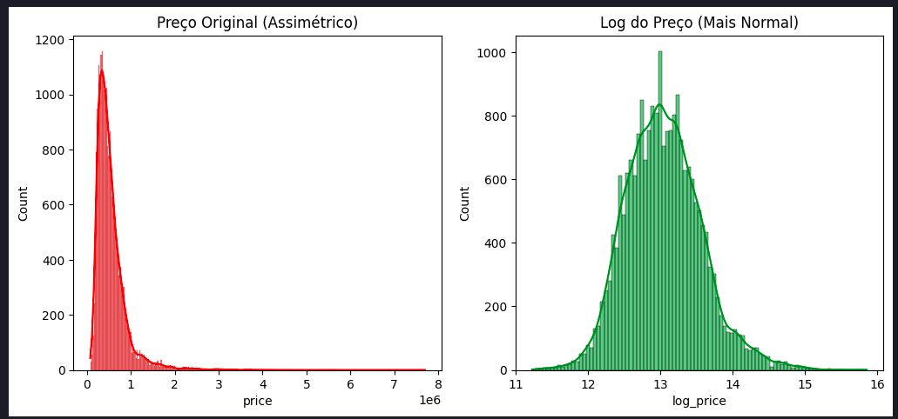
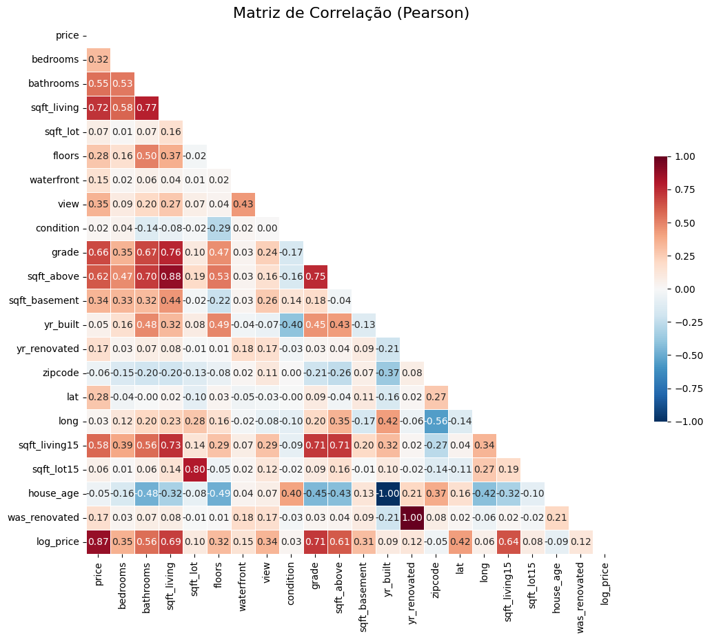
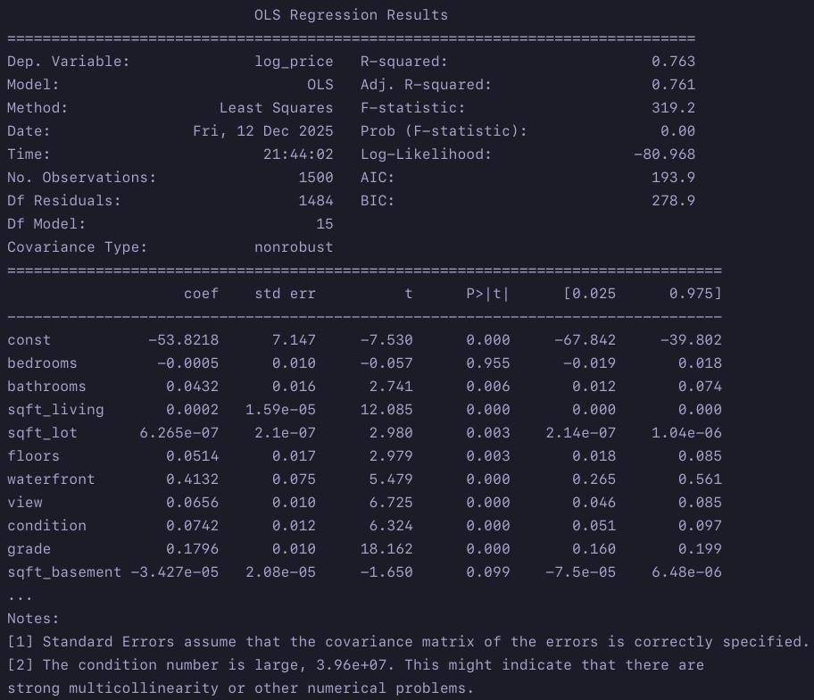
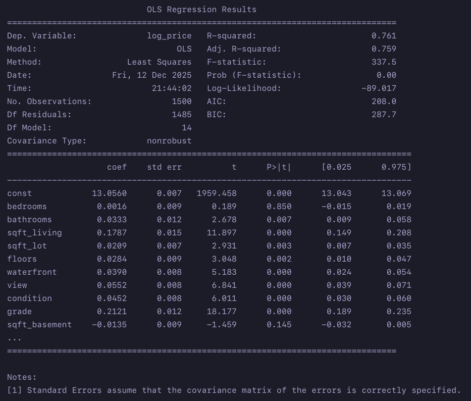
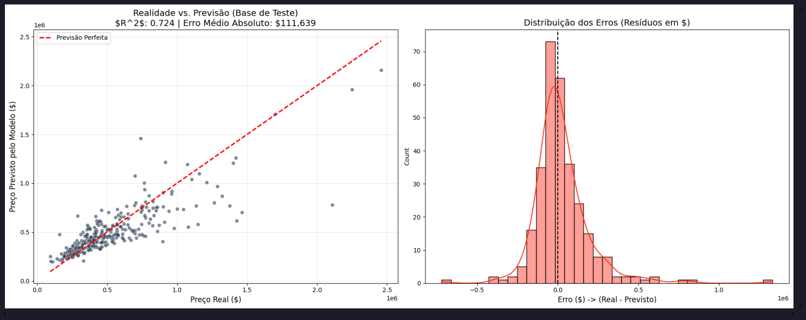
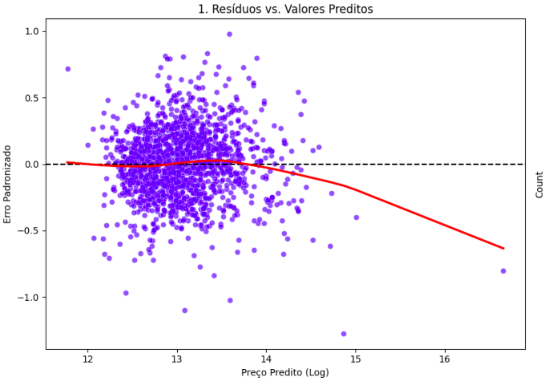
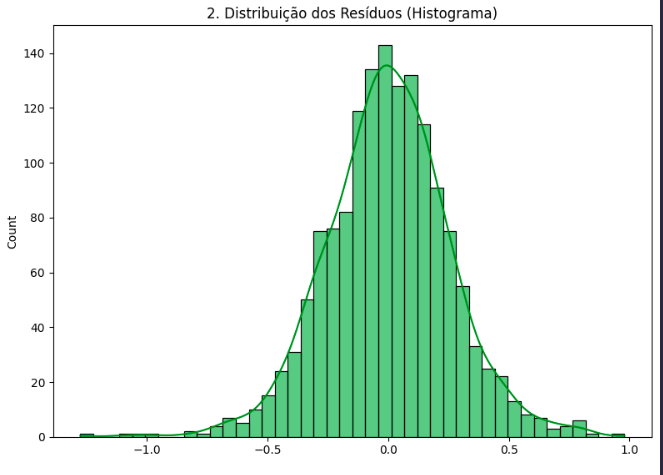
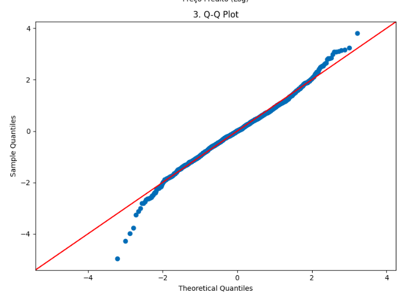
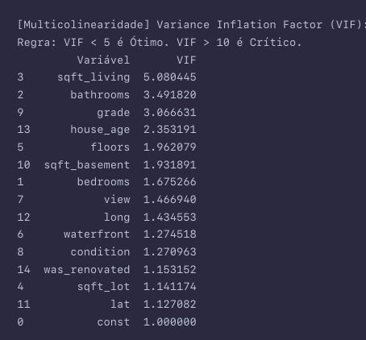
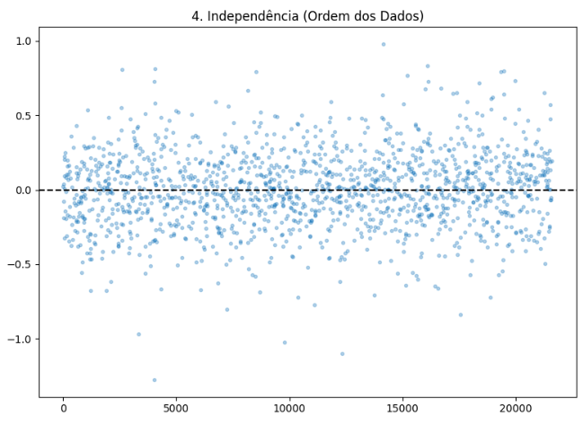

  

# Análise Preditiva de Preços de Imóveis (King County, EUA)
### Trabalho Final: Técnicas de Amostragem e Regressão Linear

**Autor:** Gabriel Fratucci dos Reis  | Nathalia Paro Muniz

**Ano:** 2025  
**Tecnologias:** Python, Pandas, Scikit-learn, Statsmodels

---

## 📋 Sobre o Projeto

Este projeto aplica técnicas de **Regressão Linear Múltipla** para prever preços de imóveis no Condado de King (incluindo Seattle), Washington, EUA. 
O objetivo principal é desenvolver um modelo estatístico capaz de estimar o valor de venda com base em características estruturais e geográficas.

O trabalho abrange a limpeza e o tratamento de dados, amostragem estratificada, a validação de pressupostos e interpretação dos coeficientes do modelo.

---

## 💾 Sobre os Dados

* **Fonte:** [Kaggle - KC House Data](https://www.kaggle.com/)
* **Dimensão:** 21.613 observações e 21 variáveis.
* **Variável Alvo:** Preço do imóvel (`price`).

---

## 🗂️ Dicionário de Dados

| Variável | Tipo | Subtipo | Descrição |
| :--- | :--- | :--- | :--- |
| **`price`** | Quantitativa | Contínua | **Variável Alvo ($y$)**. Preço de venda do imóvel. |
| `sqft_living` | Quantitativa | Contínua | Área construída do espaço interior. |
| `sqft_lot` | Quantitativa | Contínua | Área total do terreno. |
| `bathrooms` | Quantitativa | Contínua | Qtd. de banheiros (decimais indicam lavabos). |
| `bedrooms` | Quantitativa | Discreta | Número de quartos. |
| `floors` | Quantitativa | Discreta | Número de andares. |
| `yr_built` | Quantitativa | Discreta | Ano de construção. |
| `yr_renovated`| Quantitativa | Discreta | Ano de reforma. |
| `waterfront` | Qualitativa | Nominal | Vista para água (0=Não, 1=Sim). |
| `zipcode` | Qualitativa | Nominal | Código postal (Região). |
| `condition` | Qualitativa | Ordinal | Estado de conservação (Ranking). |
| `grade` | Qualitativa | Ordinal | Nível de construção/design (Ranking). |
| `view` | Qualitativa | Ordinal | Qualidade da vista (Ranking). |

## ⚙️ Metodologia e Processamento
### 1. Limpeza e Tratamento de Dados
Identificação e remoção de inconsistências que poderiam enviesar o modelo:
* **Outliers e Erros:** Remoção de registros ilógicos (ex: casas com 33 quartos mas média de 3; imóveis sem banheiros ou quartos; áreas `sqft_lot` desproporcionais).
* **Engenharia de Atributos:**
    * Criação de `house_age` (Idade do imóvel) para substituir o ano de construção.
    * Flag `was_renovated` para indicar se houveram reformas no imóvel.
* **Transformação Logarítmica:** Aplicada à variável `price` (target) para corrigir assimetria à direita e aproximar a distribuição de uma normal.

  

### 2. Amostragem Estratificada
Considerando o tamanho da base, poderiamos rodar treinar e testar o modelo sobre todo o conjunto de dados, mas para fins de estudo, vamos coletar uma amostra. 
Para evitar viés de seleção e garantir representatividade, não utilizamos amostragem aleatória simples.
* **Estratégia:** Amostragem baseada na variável `grade` (nota de avaliação da casa).
* **Motivo:** A variável `grade` apresentou a maior correlação com o preço, sendo crucial garantir que todas as categorias de "notas" estivessem representadas proporcionalmente no treino/teste.

### 3. Seleção de Variáveis (Feature Selection)
Após análise da Matriz de Correlação de Pearson, removemos variáveis redundantes ou ruidosas:

| Variável Removida | Motivo |
| :--- | :--- |
| `sqft_above` | Alta correlação (0.88) com `sqft_living`. |
| `sqft_lot15` | Alta correlação (0.80) com `sqft_lot`. |
| `yr_built` | Redundante com a nova variável `house_age`. |
| `sqft_living15` | Redundante (0.73) com `sqft_living`. |
| `zipcode` | Variável nominal tratada como numérica (gerava ruído). |

  

---

## 📊 Resultados do Modelo

### Iteração e Ajustes
1.  **Multicolinearidade:** O primeiro treino apresentou $R^2 = 76.3\%$, mas com alta multicolinearidade devido à disparidade de escalas.
2.  **Padronização:** Aplicação do `StandardScaler`. Isso revelou que a variável `grade` possui o maior peso na decisão do modelo.
3.  **Teste de Hipótese:** A variável `bedrooms` mostrou-se estatisticamente irrelevante para este modelo específico, podendo ser removida para otimizar os critérios de informação (AIC/BIC).

  

### Métricas Finais

* **R² (R-squared):** `0.76` (O modelo explica 76% da variação dos preços).
* **AIC:** `208.0` (Baixo valor, indicando bom equilíbrio entre simplicidade e erro).
* **Fatores de Influência:**
    * 🟢 `grade` (Coef: 0.2121) e `sqft_living` (Coef: 0.1787) são os maiores influenciadores positivos.
    * 🔴 Quantidade de quartos apresentou P-valor alto (>0.05), indicando irrelevância estatística neste cenário.

  

### Análise de Resíduos
O histograma de resíduos aproximou-se de uma normal, indicando que o modelo não está enviesado (viciado), embora tenda a **subestimar** imóveis de valores muito altos (luxo).

  

---
## 📊 Validação dos Pressupostos (Regressão Linear)

Para garantir a confiabilidade estatística do modelo **OLS (Ordinary Least Squares)**, foram validados os 5 pressupostos clássicos da regressão linear. Abaixo, o diagnóstico de cada item para o modelo final:

### 1. Linearidade
O modelo assume uma relação linear entre as variáveis explicativas e a variável alvo.
- **Validação:** Análise gráfica de *Resíduos vs. Valores Preditos*.
- **Ação:** Aplicada transformação logarítmica (`np.log`) nas variáveis `price` e `sqft_lot` para linearizar as relações exponenciais observadas.
- **Status:** ✅ **Atendido** (Tendência linear confirmada após transformações).

  

### 2. Homocedasticidade
A variância dos erros deve ser constante para todas as observações (ausência de "funil" nos resíduos).
- **Validação:** Inspeção visual do scatterplot *Resíduos vs. Preditos*.
- **Resultado:** Observou-se leve heterocedasticidade nos imóveis de alto luxo (comum no setor imobiliário), mas controlada pela padronização (`StandardScaler`).
- **Status:** ⚠️ **Aceitável** (Variação controlada, não compromete a inferência).

  

### 3. Normalidade dos Resíduos
Os erros de previsão devem seguir uma Distribuição Normal para que os intervalos de confiança sejam válidos.
- **Validação:** Histograma dos Resíduos, Q-Q Plot e teste de Jarque-Bera.
- **Resultado:** O teste Jarque-Bera indicou desvio da normalidade estrita (devido a outliers remanescentes nas caudas).
- **Justificativa:** Com **N = 1.500 observações**, apoiamo-nos no **Teorema Central do Limite (CLT)**, que garante a estabilidade dos estimadores mesmo com leves desvios de normalidade nos resíduos.
- **Status:** ✅ **Atendido (via CLT)**.

  

### 4. Ausência de Multicolinearidade
As variáveis independentes não devem ter alta correlação entre si (redundância).
- **Validação:** Cálculo do **VIF (Variance Inflation Factor)**.
- **Critério:** VIF < 10 (Ideal < 5).
- **Ação:** Remoção estratégica de variáveis redundantes (ex: `sqft_above` removida em favor de `sqft_living`).
- **Status:** ✅ **Atendido** (Todas as variáveis do modelo final possuem VIF controlado).

  

### 5. Independência dos Erros
Os resíduos não devem apresentar autocorrelação (padrões dependentes entre observações vizinhas).
- **Validação:** Teste de **Durbin-Watson**.
- **Resultado:** O valor do teste situou-se na faixa de **1.5 a 2.5**.
- **Status:** ✅ **Atendido** (Ausência de autocorrelação serial ou espacial significativa).

  

---
## 🚀 Conclusão

O modelo final é funcional e estatisticamente robusto para a maioria dos casos no Condado de King. 
A padronização e a seleção criteriosa de variáveis permitiram um ajuste de 76%, com destaque para a importância da área útil e da nota de avaliação (`grade`) na composição do preço.

---
