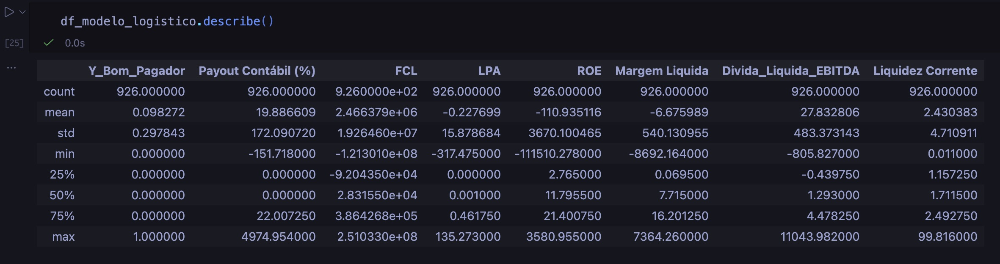
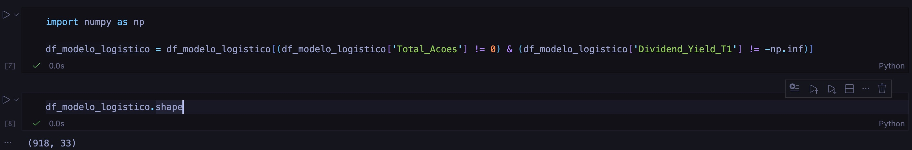
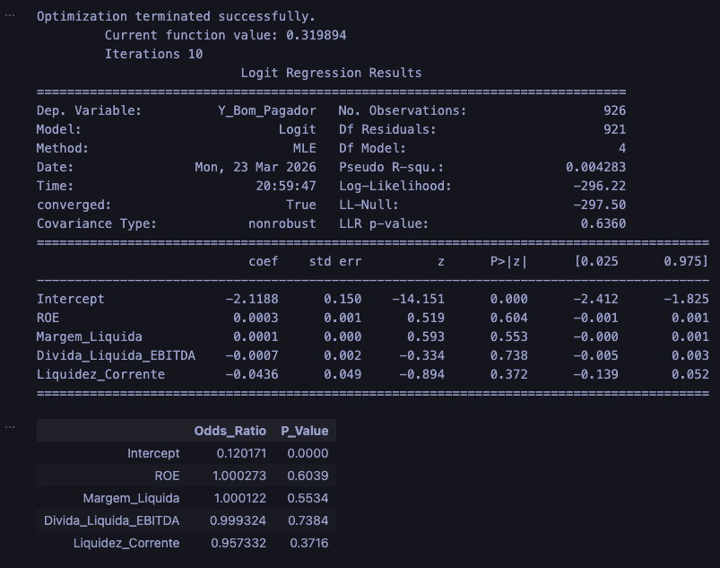
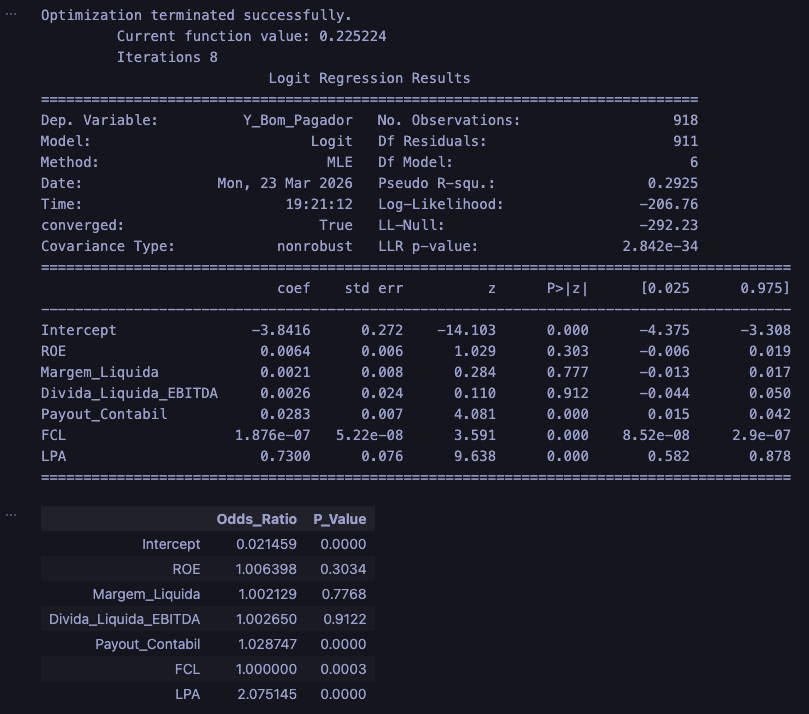
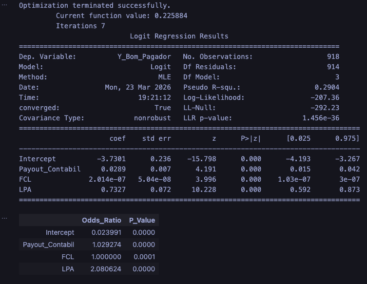
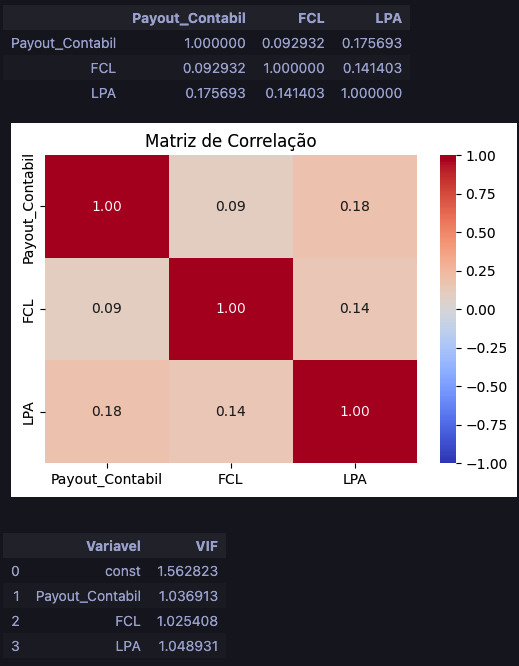
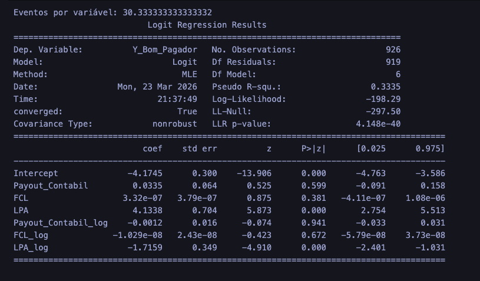

  

# Previsão de Pagamento de Dividendos (Dividend Yield > 6%) usando Regressão Logística
### Trabalho Final: Modelos de Regressão

**Autor:** Gabriel Fratucci dos Reis

**Ano:** 2026  
**Tecnologias:** Python, Pandas, Scikit-learn, Statsmodels

### 1. Seleção da Base de Dados

A base de dados foi construída a partir da consolidação de duas fontes principais:

Dados Contábeis e Financeiros: Extraídos dos demonstrativos padronizados da CVM (Comissão de Valores Mobiliários), contendo métricas como Lucro Por Ação (LPA), Fluxo de Caixa Livre (FCL) e Payout Contábil.

Dados de Mercado: Histórico de cotações extraído via biblioteca yfinance para capturar o preço de fechamento ajustado do último pregão de cada ano.
A união foi feita utilizando o CNPJ e o código CVM como chaves primárias.

### 2. Contextualização do Problema

O mercado financeiro possui alta volatilidade e a escolha de ativos pagadores de dividendos é uma estratégia consolidada. O problema consiste em prever se uma empresa listada na B3 será classificada como uma "Boa Pagadora" no ano seguinte.

- Variável Resposta (Target): Y_Bom_Pagador (Binária).
- Critério: Recebe 1 se o Dividend Yield (Dividendos Pagos / Valor de Mercado) for $\ge$ 0.06 (6%), e 0 caso contrário.

### 3. Processamento de Dados

O pipeline de tratamento envolveu as seguintes etapas:Higienização de Chaves: 

- Padronização de CNPJs (preenchimento com zeros à esquerda até 14 dígitos) para cruzamento exato (Left Join) entre as bases da CVM e da B3.
- Criação da Variável Alvo: Cálculo do Dividend Yield utilizando os dividendos pagos em $T+1$ divididos pelo valor de mercado em $T$.
- Inserção da cotação de cada ativo usando a biblioteca yfinance

### 4. Análise de Variáveis

Análise da Base de Dados

  

Limpeza Básica dos Dados

  

A análise descritiva da base bruta (918 observações) revelou:

- Desbalanceamento da Variável Alvo: A média da variável Y_Bom_Pagador é de $0.0982$. Isso comprova que apenas $\approx$ 9,8% da amostra atingiu o critério de pagar mais de 6% de Dividend Yield.
- Presença de Outliers Extremos: A variável Payout Contábil, possui uma mediana (50%) de $0.00$, mas um valor máximo de $4974.95$ (distribuição muito acima do lucro do exercício, possivelmente por venda de ativos ou uso de reservas). O mesmo ocorre no ROE (mínimo de -111.510) e na Margem Liquida. Esses valores extremos justificam a necessidade absoluta da técnica de winsorização aplicada na etapa de processamento.
- Discrepância de Escalas: A variável FCL (Fluxo de Caixa Livre) opera na escala de centenas de milhões (ordem de grandeza $e+08$), enquanto indicadores como LPA e Liquidez Corrente operam em unidades ou dezenas. Essa assimetria exige atenção na interpretação dos coeficientes (Odds Ratios) gerados pelo modelo logístico final.

Variáveis da Base de Dados:### Dicionário de Dados

| Variável | Tipo | Descrição |
| :--- | :--- | :--- |
| **Y_Bom_Pagador** | Binária (0 ou 1) | Variável alvo (*target*). Assume o valor `1` se a empresa obteve um *Dividend Yield* $\ge$ 6% no ano seguinte (T+1), e `0` caso contrário. |
| **Dividend_Yield_T1** | Numérica Contínua | Rendimento de dividendos no ano seguinte (T+1). Calculado pela razão entre os dividendos pagos em T+1 e o Valor de Mercado da empresa no fechamento do ano T. |
| **Payout Contábil (%)** | Numérica Contínua | Percentual do lucro líquido do exercício que foi distribuído aos acionistas na forma de proventos (Dividendos e JCP). |
| **FCL** | Numérica Contínua | Fluxo de Caixa Livre. Mede o montante de caixa gerado pelas operações da empresa após a dedução dos investimentos em capital fixo (CAPEX). |
| **LPA** | Numérica Contínua | Lucro Por Ação. Indica a parcela do lucro líquido total alocada a cada ação emitida pela empresa. |
| **ROE** | Numérica Contínua | Retorno sobre o Patrimônio Líquido (*Return on Equity*). Mede a rentabilidade da empresa sobre os recursos investidos pelos acionistas. |
| **Margem Liquida** | Numérica Contínua | Razão entre o lucro líquido e a receita líquida. Indica a porcentagem de receita que restou como lucro após a dedução de custos e despesas. |
| **Divida_Liquida_EBITDA** | Numérica Contínua | Métrica de alavancagem. Demonstra o número de anos que a empresa levaria para pagar sua dívida líquida utilizando a geração de caixa operacional atual (EBITDA). |
| **Liquidez Corrente** | Numérica Contínua | Indicador de solvência de curto prazo. Mede a capacidade da empresa de arcar com suas obrigações no curto prazo (Ativo Circulante dividido pelo Passivo Circulante). |

### 5. Execução de Modelo

Conclusões do Modelo 1 (Baseline):

  

A primeira execução provou que métricas operacionais expostas a valores extremos (outliers) não explicam a distribuição de proventos.

Validade Global: O modelo foi estatisticamente insignificante, com LLR p-value de 0.6360 (muito acima do limite de 0.05) e Pseudo R-squared de apenas 0.0042 (0,4%).

Coeficientes: Nenhuma variável apresentou p-valor válido. Os Odds Ratios resultaram próximos a 1.00, indicando zero impacto na probabilidade do evento. Uma empresa pode ter alto ROE e reter todo o lucro, invalidando a predição.

Conclusões do Modelo 2 (Novas variáveris e Winsorização):

  

Este modelo avalia o impacto conjunto de seis indicadores financeiros após o tratamento de outliers. 

Apresenta validade estatística global (LLR p-value de 2.842e-34) e explica 29,25% do evento (Pseudo R² = 0.2925). 

A tabela de coeficientes revela que os indicadores de rentabilidade e alavancagem (ROE, Margem Líquida e Dívida Líquida/EBITDA) falharam no teste de significância (p-valores > 0.05), indicando que não possuem poder preditivo sobre a distribuição de dividendos na amostra. Apenas Payout, FCL e LPA demonstraram relevância estatística.

Conclusões do Modelo 3 (Modelo Parcimonioso):

  

Este modelo refina a análise anterior excluindo as variáveis insignificantes. 

O resultado demonstra a eficácia da parcimônia: o poder explicativo manteve-se estável (Pseudo R² = 0.2904), enquanto a significância global do modelo aumentou (LLR p-value de 1.456e-36). 

Todas as três variáveis mantidas (Payout Contábil, FCL e LPA) apresentam p-valores de 0.000, validando-as como preditores definitivos. 

### 6. Validação de Pressupostos

  

Análise de Correlação
A matriz de correlação evidenciou ausência de forte dependência linear entre as variáveis independentes. A maior correlação encontrada foi entre Payout Contábil e LPA ($r = 0.18$), considerada fraca.

Validação de Pressupostos (Multicolinearidade)
O teste VIF (*Variance Inflation Factor*) validou o pressuposto de ausência de multicolinearidade. Mantendo-se rigorosamente abaixo do limite crítico de 5. 

Interpretação dos Coeficientes (Odds Ratio)
Com a independência das variáveis comprovada, a leitura dos multiplicadores de chance (*Odds Ratios*) ocorre de forma isolada (*ceteris paribus*):

* **LPA ($OR \approx 2.08$):** Variável de maior impacto. O aumento de R$ 1,00 no Lucro Por Ação eleva a chance da empresa ser uma boa pagadora de dividendos no ano seguinte em 108% (probabilidade mais que dobra).
* **Payout Contábil ($OR \approx 1.029$):** O acréscimo de 1% no histórico de distribuição de lucros da empresa aumenta as chances do evento em aproximadamente 2,9%.
* **FCL ($OR = 1.000$):** Estatisticamente significativo ($p < 0.05$), o Fluxo de Caixa Livre atua como um validador de liquidez. O multiplicador resulta em 1 devido à sua escala bruta (reais absolutos), indicando que a geração real de caixa autoriza o pagamento, mas a variação de apenas R$ 1,00 não altera a probabilidade de forma isolada.

  

Tamanho Adequado da Amostra: O pressuposto de volumetria foi atendido. O teste registrou 30,33 eventos da classe minoritária (empresas boas pagadoras) para cada variável independente do modelo. Este número é três vezes superior ao limite mínimo exigido pela literatura estatística (regra de 10 eventos por variável), garantindo graus de liberdade suficientes para o algoritmo e afastando o risco de sobreajuste (*overfitting*).

Linearidade com o Log-Odds (Teste de Box-Tidwell): O teste verificou se a relação entre as variáveis contínuas e o logaritmo das chances é linear. 

  * As variáveis `Payout_Contabil` e `FCL` foram aprovadas (p-valores de interação de 0.941 e 0.672, respectivamente). 
  * A variável `LPA` apresentou p-valor de 0.000, indicando não linearidade. No contexto financeiro, isso é esperado e mantido no modelo

### 7. Conclusão

O modelo logístico parcimonioso comprovou estatisticamente que a distribuição de dividendos é impulsionada pela geração real de caixa, lucratividade direta por ação e histórico de repasse, invalidando o uso de métricas operacionais genéricas. O tratamento de dados extremos via winsorização foi o fator determinante para garantir a estabilidade.

